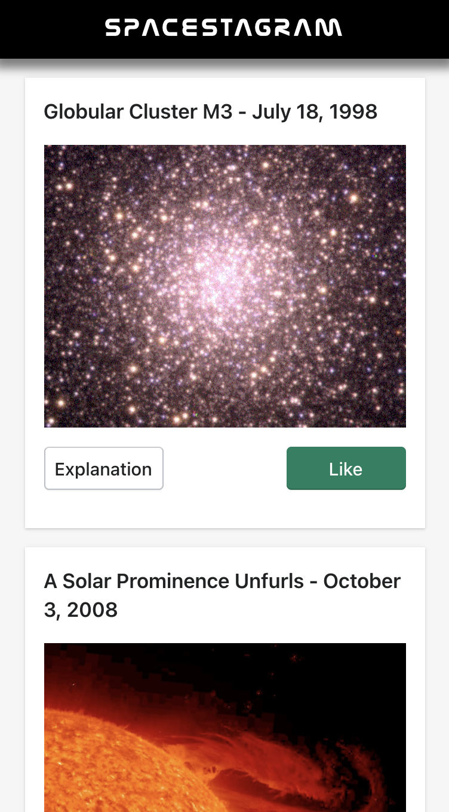

# Spacestagram

[Live Demo: Try Out Spacestagram Here](https://spacestagram-three.vercel.app/)

This is a coding challenge included in Shopify's Front End Developer Internship application. The assignment was to build a webpage that pulls images from one of NASA's APIs and allows users to like and unlike images.

### Built With 
- React
- Polaris
- NASA's Astronomy Picture of the Day API
- Deployed with Vercel

### Highlights
- Utilized of Polaris, Shopify's React component library
- Users can like/unlike images by clicking on the image
- Heart animation when a image is liked/unliked
- Found and used a NASA style font for branding

